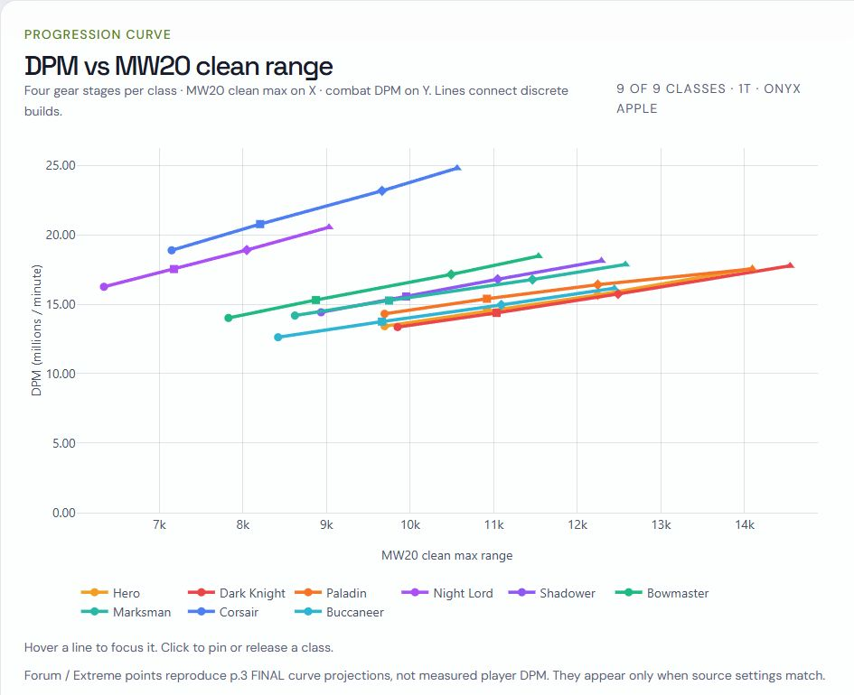

# MapleRoyals DPM Lab — Gear Progression Engine

[Open the website](https://mapleroyals-dpm.netlify.app/) · [Model assumptions](docs/model-assumptions.md) · [Sources](docs/source-index.md) · [Validation status](docs/validation-status.md)

Explore gear progression and modeled damage for nine MapleRoyals classes. Compare four reference builds, change potions and combat conditions, or enter your own character through User Preset.

**These are idealized theoretical estimates, not measured boss-run damage, clear-time predictions, or practical class rankings.** Movement, knockback, attack uptime, Battleship availability, cooldown execution, summons, and party utility can change actual performance.



## Main workflows

- **Progression:** Entry, Advanced, Late-game, and End-game reference builds; one target count selected at a time.
- **User Preset:** No-MW clean panel or equipment-by-slot input, with up to three presets.
- **Model Library:** gear inputs, mechanics, calculation traces, and evidence status.
- Adjust potions, combat buffs, and bounded WDEF presets while keeping conditions explicit.

Supported classes: Hero, Dark Knight, Paladin, Night Lord, Shadower, Bowmaster, Marksman, Corsair, and Buccaneer.

Quick verification uses equipped totals without MW and attack buffs. Progression X is MW20-normalized clean maximum range; Y is modeled combat DPM.

## How this project was built

The author developed the class DPM models individually through information gathering, discussion, calculation checks, and revisions. Skill timing, critical behavior, caps, buffs, target limits, and rotations were handled class by class. Gear stages were likewise assembled and checked for each class, including stats, weapon attack, ammunition, and passives.

AI assisted research discussions and calculations. The author directed the process and reviewed decisions; this was ongoing iterative work, not a complete project produced automatically from one request. Unresolved assumptions remain documented.

**Website architecture and programming were carried out by Codex**, including calculation implementation, structured data, interactive controls, Plotly charts, User Preset, Model Library, test/build tooling, and website setup. Correct implementation and correct game assumptions are separate questions; passing tests does not prove every mechanic or encounter.

## Run locally

Use Node.js 22 or a compatible newer release. The package currently has no npm dependencies to install. Charts load Plotly from the CDN referenced in `index.html`, so chart rendering requires internet access.

```text
git clone https://github.com/Adagietto-k284/mapleroyals-dpm-demo.git
cd mapleroyals-dpm-demo
npm run dev
```

Open the local address printed by the server, normally `http://127.0.0.1:4173/`.

```text
npm test
npm run build
```

Build output goes to `dist/`. A local server is required to load ES modules and JSON data. This public source snapshot does not create another deployment or replace the live website.

## Read the source

| Location | Purpose |
| --- | --- |
| `engine/` | Shared core and nine class engines |
| `data/` | Gear, skills, potions, buffs, versions, reference inputs |
| `test/` | Calculation, data-contract, UI-contract, build checks |
| `reference/` | Project-authored historical baselines and audits |
| `docs/model-assumptions.md` | Interpretation and practical limits |
| `docs/source-index.md` | Public references and provenance gaps |
| `docs/validation-status.md` | Current baseline and pending checks |
| `docs/image-guide.md` | Conditions for the five forum screenshots |

Inherited development documents may describe earlier phases and carry a historical-record banner. Use this README and current validation status for present scope.

## Forum references

Forum median/#1 are stored range references. Displayed reference DPM uses frozen-curve interpolation/extrapolation, not measured damage or an exact player gear reconstruction. Stored #1 labels do not identify today's leaderboard.

See the [Official Damage Range Thread](https://royals.ms/forum/threads/mapleroyals-official-damage-range-thread.177089/) for public rankings/rules. Exact model snapshot dates, included entries, and per-record source mapping remain incomplete. The [Krex Class DPS Comparison](https://royals.ms/forum/threads/krex-class-dps-comparison.224575/) supplies separate historical observations under different conditions.

## Limits and feedback

Buccaneer 4T/6T workbook reconciliation, Corsair overall/gun details, original formula/gear attribution, and Forum snapshot provenance remain incomplete.

For discrepancies, include class/weapon, gear stage or preset inputs, potion, targets, WDEF, buffs, displayed/expected result, source, and date checked. [Open an issue](https://github.com/Adagietto-k284/mapleroyals-dpm-demo/issues).

## Publication and licensing

This is an independent public source snapshot with fresh history. Private conversation links/message IDs, developer handoff material, and original binary workbooks are omitted. Numerical model fields are preserved during provenance cleanup.

No open-source license has been selected. Public visibility does not grant a general license to reuse or redistribute code or third-party reference material.
